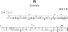

# Tsugaru shamisen notation for LilyPond

This is a work in progress, but should be adequate for most pieces.
Contributions, bug reports, and suggestions are very welcome.

## Usage

If you're familiar with Git, clone this repository and add it to LilyPond's
include path. If not, the simplest way to get started is to
[download the latest version of `shamisen.ly`](https://raw.githubusercontent.com/threedaymonk/lilypond-shamisen/docs/shamisen.ly)
and put it in the same directory as the `.ly` file you're working on.

Include shamisen support:

    \include "shamisen.ly"

The default staff size is quite small. Make it bigger if you wish:

    #(set-global-staff-size 24)

Depending on your system, the default font will not support Japanese. If you
want to use Japanese in the title or metre, you will need to change it. See
also the section on Fonts below.

    \paper{
      #(define fonts
        (set-global-fonts
         #:roman "IPAexGothic"
         #:factor (/ staff-height pt 20)
        ))
    }

Create a tab staff, set the tuning, tell it to use shamisen notation, and
insert notes according to the usual
[LilyPond text format](http://lilypond.org/text-input.html):

    \score {
      \new TabStaff {
        \set TabStaff.stringTunings = #niagariTuning
        \shamisenNotation
        \time 2/4

        c8 es f g % etc. etc.

      }
    }

### Predefined tunings

- `honchoushiTuning` (C F C')
- `niagariTuning` (C G C')
- `sansagariTuning` (C F B♭')

### String selection

The default behaviour of LilyPond is to place notes on the lowest position
(i.e. the highest string) possible. This can be overridden in the normal way:

    c'\2 % play on the middle string（２の糸）
    c'\3 % play on the lowest string（１の糸）

Note that LilyPond numbers the strings in the *opposite* way from
normal shamisen usage: the lowest string is 3, and the highest is 1.

(Although it is possible to reverse the order of strings and tablature in
LilyPond and thus use the shamisen numbering convention, this breaks
automatic note placement, with the result that all notes are placed on the
lowest string. As this is more annoying than reversed numbering, we don't do
this.)

### Annotations

These extend the normal LilyPond annotations to add:

- `\hajiki` left-hand pluck ハ
- `\sukui` upstroke ス
- `\uchi` hammer-on ウ
- `\oshi` oshibachi ⅃
- `\keshi` mute ケ

Example:

    g \hajiki

### Fingering indications

This can be achieved in the normal way, but for convenience Roman numerals for
Ⅰ, Ⅱ, Ⅲ are defined as `\first`, `\second`, `\third` etc.:

    f16^\third

### Underlines for note lengths

These are entered as notes in the normal way:

    c4  % -> 0
    c8  % -> 0 with single underline
    c8. % -> 0 with single underline and dot
    c16 % -> 0 with double underline
    c32 % -> 0 with triple underline

### Dot rests

These are entered as rests in the normal way:

    r4 % -> dot
    r8 % -> dot with single underline
    % etc.

### 4300 phrases and similar

The `\trtr { ... }` (TsuRuTaRa) function squashes the spacing of the
notes within the braces:

    \trtr { c'16\2^\third bes \hajiki g \hajiki g }

## Limitations

### Half notes

Some scores use a small square box to distinguish half notes from quarter notes.
This is not implemented.

## Implementation notes

Underlining of notes is implemented as a different stencil for the note stem.

The non-semitonal numbering of positions is achieved by a lookup function.

Hajiki, sukui, etc. are normal annotations, using custom stencils.

## Bonus

Also included is a small Ruby program that can convert a simple LilyPond-like
language based on tablature into notes, to assist in transcribing existing
works. See sakura-sakura.input.ly for an example of how this works.

## Fonts

In my experience, LilyPond has problems (i.e. errors) when working with some
Japanese fonts. The font *IPAexGothic* works well and is free to download from
the website of the
[Information-technology Promotion Agency](https://ipafont.ipa.go.jp/node26#en)
in Japan ([ipaexg00301.zip](https://oscdl.ipa.go.jp/IPAexfont/ipaexg00301.zip))
or by installing the [fonts-ipaexfont](apt:fonts-ipaexfont) package on Ubuntu.
